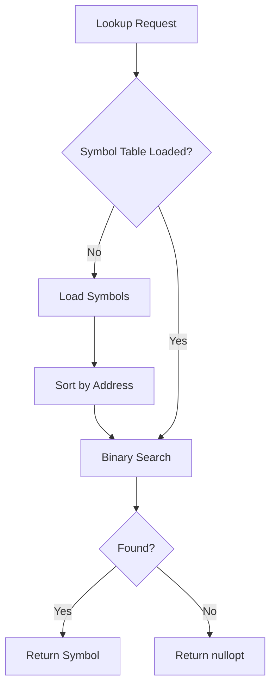
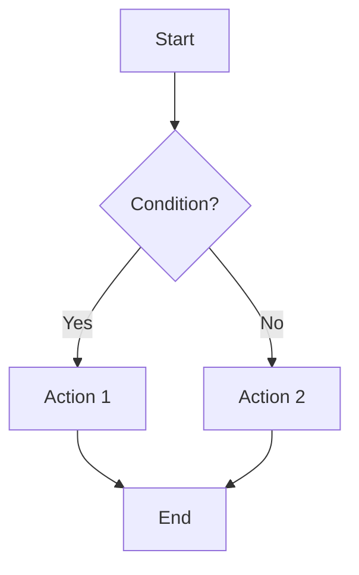
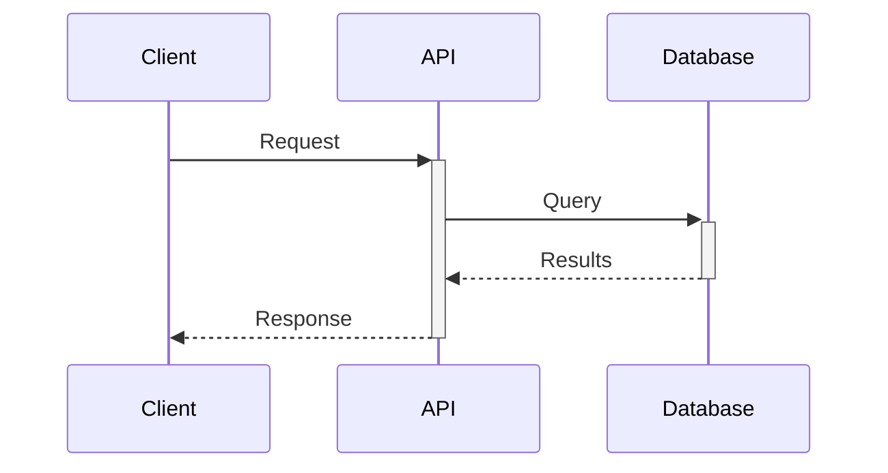
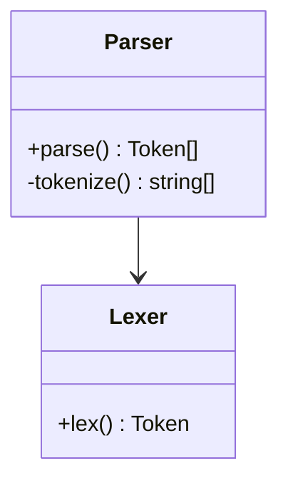
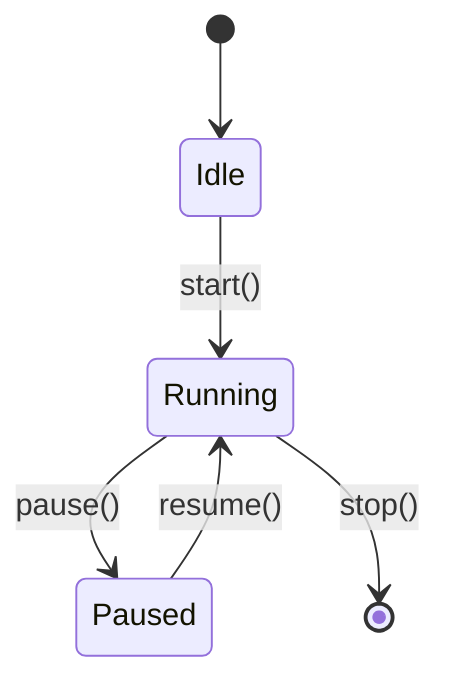

# Documentation Standards

> Engineering documentation practices for code clarity and architectural decisions

## Overview

Effective documentation balances completeness with maintainability. Code should be self-documenting through clear naming and structure, with explicit documentation reserved for cases where code alone cannot convey intent, complexity, or context.

## Documentation Hierarchy

### 1. Self-Documenting Code (Preferred)

**Principle:** Code should be the primary documentation through:
- Clear, descriptive naming (functions, variables, types)
- Small, focused functions with single responsibilities
- Consistent patterns and idioms
- Type systems that encode constraints

**When sufficient:**
- Straightforward algorithms
- Standard patterns and idioms
- Operations with obvious intent
- Simple data transformations

### 2. Inline Documentation (When Needed)

**Use for:**
- Complex algorithms requiring explanation
- Non-obvious implementation decisions
- Performance-critical sections with specific optimizations
- Workarounds for known issues or limitations
- Public APIs and interfaces

**Format:**
- Language-standard comment conventions (Doxygen, JSDoc, etc.)
- Brief and focused
- Explain "why" not "what"
- Document preconditions, postconditions, invariants

**Example (C++):**
```cpp
// Binary search requires sorted input. We maintain this invariant
// by sorting in AddSymbol() rather than here for O(log n) lookups.
std::optional<std::string> GetSymbol(uint32_t address) const;
```

**Example (Python):**
```python
def calculate_optimal_path(graph: Graph, start: Node) -> List[Node]:
    """Find optimal path using A* with Manhattan distance heuristic.

    We use Manhattan distance because our grid allows only 4-directional
    movement. Euclidean distance would overestimate and degrade performance.

    Args:
        graph: Grid-based graph with obstacles
        start: Starting node coordinates

    Returns:
        Ordered list of nodes from start to goal, or empty if no path exists
    """
    pass
```

### 3. Markdown Documentation (Complex Cases)

**Use when inline docs are insufficient:**
- Multi-step algorithms spanning multiple functions
- Complex state machines or workflows
- Intricate data flow requiring visualization
- System interactions and dependencies

**Location:**
- Same directory as the code
- Named descriptively (e.g., `authentication-flow.md`, `parsing-algorithm.md`)

**Format:**
- Brief overview/summary
- Mermaid diagrams for visual representation
- Step-by-step breakdown if needed
- Links to relevant code files

**Example structure:**
```markdown
# Symbol Table Lookup Algorithm

## Overview
Fast symbol resolution using binary search with lazy symbol loading.

## Data Flow



## Implementation Details
- Symbol table: `src/core/symbol_table.cpp:42`
- Binary search: `src/core/symbol_table.cpp:156`
- Lazy loading rationale: Defers expensive I/O until first use
```

### 4. Architectural Decision Records (ADRs)

**Use for:**
- Significant architectural choices
- Technology stack decisions
- Design pattern selections
- Trade-off analyses

**Location:**
- `docs/adr/` or `adr/` directory at project root
- Numbered sequentially (e.g., `0001-use-binary-search.md`)

**Format (Standard ADR Template):**
```markdown
# ADR-NNNN: [Title]

## Status
[Proposed | Accepted | Deprecated | Superseded]

## Context
What is the issue we're facing? What factors are driving this decision?

## Decision
What is the change we're proposing/making?

## Consequences
What becomes easier or harder as a result of this decision?

### Positive
- [Benefit 1]
- [Benefit 2]

### Negative
- [Drawback 1]
- [Drawback 2]

### Neutral
- [Trade-off 1]

## Alternatives Considered
- [Alternative 1]: Why rejected
- [Alternative 2]: Why rejected

## References
- [Link to relevant discussion]
- [Related ADRs]
```

**Example:**
```markdown
# ADR-0003: Use Binary Search for Symbol Lookup

## Status
Accepted (2026-01-08)

## Context
Symbol lookups are on the critical path for disassembly. With large binaries
(10K+ symbols), linear search becomes a performance bottleneck. Profiling
showed 40% of disassembly time spent in symbol resolution.

## Decision
Implement binary search over sorted symbol table using std::lower_bound.
Sort symbols once during load, maintain sort invariant on updates.

## Consequences

### Positive
- O(log n) lookups vs O(n) - 100x speedup for large binaries
- Leverages STL algorithms (well-tested, optimized)
- Natural fit for address-based lookups

### Negative
- O(n log n) sort cost on symbol table modifications
- Slightly more complex than linear search
- Must maintain sort invariant carefully

### Neutral
- Memory overhead negligible (symbols already in memory)

## Alternatives Considered
- Hash table: Rejected - address ranges poorly suited to hashing
- Trie: Rejected - overkill for numeric keys, higher memory overhead
- Keep linear search: Rejected - unacceptable performance at scale

## References
- Performance analysis: `docs/performance/symbol-lookup-benchmark.md`
- Implementation: `src/core/symbol_table.cpp:156`
```

## Mermaid Diagram Types

Use appropriate diagram types for different documentation needs:

### Flowchart
**Use for:** Algorithms, decision trees, control flow


### Sequence Diagram
**Use for:** Component interactions, API calls, message passing


### Class Diagram
**Use for:** Object relationships, inheritance hierarchies


### State Diagram
**Use for:** State machines, lifecycle management


## Best Practices

### DO
- ✅ Prefer self-documenting code over comments
- ✅ Document "why" not "what"
- ✅ Use diagrams for complex flows
- ✅ Keep documentation close to code
- ✅ Update docs when code changes
- ✅ Use ADRs for significant decisions
- ✅ Version control all documentation
- ✅ Link from docs to code (file:line references)

### DON'T
- ❌ Comment obvious code
- ❌ Let documentation drift from implementation
- ❌ Over-document simple code
- ❌ Use comments to explain bad code (refactor instead)
- ❌ Store docs in separate, disconnected locations
- ❌ Write documentation that duplicates code
- ❌ Skip documentation for complex algorithms

### Code Comments - When to Use

**YES - Document these:**
```cpp
// Performance: Using reserve() prevents reallocation during loop
symbols.reserve(estimated_count);

// FIXME: Race condition if called concurrently. Add mutex.
void UpdateCache() { /* ... */ }

// Invariant: symbols must remain sorted by address for binary search
void AddSymbol(Symbol s) {
    symbols.push_back(s);
    std::sort(symbols.begin(), symbols.end());
}
```

**NO - Don't document obvious code:**
```cpp
// BAD: Comment just repeats code
// Increment counter
counter++;

// BAD: Obvious from function name
// Get the symbol at the given address
std::optional<std::string> GetSymbol(uint32_t addr);

// BAD: Should be in commit message, not code
// Added by John on 2024-03-15
void ProcessData() { /* ... */ }
```

## Documentation Checklist

### For Complex Algorithms
- [ ] Algorithm name/description at function level
- [ ] Time/space complexity if non-trivial
- [ ] Preconditions and postconditions
- [ ] Invariants that must be maintained
- [ ] External markdown + Mermaid if multi-function

### For Public APIs
- [ ] Purpose and use cases
- [ ] Parameter descriptions and constraints
- [ ] Return value semantics
- [ ] Error conditions and exceptions
- [ ] Example usage (if non-obvious)

### For Architectural Decisions
- [ ] ADR created in `adr/` or `docs/adr/`
- [ ] Context and problem statement
- [ ] Decision with rationale
- [ ] Consequences (positive and negative)
- [ ] Alternatives considered
- [ ] References to related discussions/docs

## Integration with Development Workflow

### During Development
1. Write self-documenting code first
2. Add inline docs for complex sections as you go
3. Create markdown/Mermaid docs if algorithm spans multiple functions
4. Write ADR before implementing significant architectural changes

### During Code Review
- Verify complex code has appropriate documentation
- Check that docs match implementation
- Suggest markdown+Mermaid for hard-to-understand flows
- Ensure ADR exists for architectural changes

### During Refactoring
- Update or remove outdated comments
- Simplify code to reduce need for documentation
- Consolidate scattered docs if architecture changes
- Update ADR status if decision is superseded

## Examples by Language

### C++
```cpp
/**
 * Disassemble instruction at given address using specified CPU.
 *
 * This function is the core of the disassembly engine. It delegates
 * to CPU-specific implementations and handles symbol resolution.
 *
 * Algorithm details: See docs/disassembly-algorithm.md
 *
 * @param address Memory address to disassemble
 * @param cpu CPU architecture (must match loaded binary)
 * @return Disassembled instruction or error
 */
Result<Instruction> Disassemble(uint32_t address, CPU* cpu);
```

### Python
```python
def optimize_route(
    waypoints: List[Coordinate],
    constraints: RouteConstraints
) -> OptimizedRoute:
    """Optimize delivery route using simulated annealing.

    Implementation: Travelling salesman problem (TSP) variant with
    time windows and vehicle capacity constraints.

    Algorithm visualization: docs/routing/simulated-annealing.md

    Args:
        waypoints: Delivery locations in order
        constraints: Vehicle capacity, time windows, etc.

    Returns:
        Optimized route with total distance and estimated time

    Raises:
        RouteInfeasibleError: If no valid route satisfies constraints
    """
    pass
```

## Tools Integration

### Doxygen (C++)
- Use Doxygen format for API documentation
- Generate HTML docs for public interfaces
- Integrate with CI/CD pipeline

### Sphinx (Python)
- Use reStructuredText or Markdown
- Auto-generate API docs from docstrings
- Host on Read the Docs or similar

### JSDoc (JavaScript/TypeScript)
- Type annotations in comments
- Generate HTML documentation
- Integrate with IDE tooltips

## Summary

**Documentation Hierarchy (from most to least preferred):**
1. Self-documenting code (naming, structure, types)
2. Inline comments (complex algorithms, non-obvious decisions)
3. Markdown + Mermaid (multi-function algorithms, complex flows)
4. ADRs (architectural decisions, significant trade-offs)

**Guiding Principle:**
> "Documentation should make the complex comprehensible, not make the simple complicated."

The best documentation is the minimum needed to understand the code's intent, with a bias toward making the code itself more understandable rather than explaining unclear code with comments.

---

**Version:** 1.0.0
**Last Updated:** 2026-01-08
